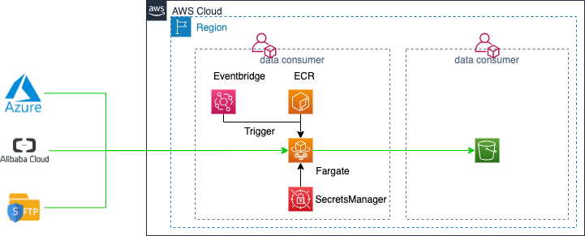

[toc]

# Azure2S3 module introduction

This module will replicate the data from Microsoft Azure object storage to Amazon S3.

## Which tools are involed
- Terraform
- rclone
- Amazon ECS
- Amazon SecretsManager
- Python
- Docker
  
## Security
Your sensitive information will be saved into SecretsManager. 
- access key
- access secret key

## Terraform module structure
- azure2S3.tf, main module which integrates all block together.
- variables.tf, define the variables which you need to provide for this module.
- azure2S3-Docker, which includes the ECR images defination.
- Doc, which includes the module configuration doc.
- conf, which includes the Azure2S3 configuration.

## Depyloment


## How to use this module

### Step 1

This module still does follow the design keynote, everything kicks off from the dataset. 
First, Create your dataset from the Data Portal.
And then, get the following information of the DataSet.
- Dataset name
- Source
  - Azure Storage Account Name
  - Azure Storage Account's Key
- Destination 
  - S3 bucket name
  - KMS arn
  - access_key
  - secret_access_key
  - region

### Step 2
Download the [terraform](https://www.terraform.io/downloads.html)

### Step 3
Create the directory to include your terraform file.
```hcl
module "Azure2S3" {
  source = "/Users/picomy/Playground/Azure2S3-tf"

  DataSetName = "dataset-5"
  
  vpcID          = "vpc-0d680669"
  subnetIDs      = ["subnet-eabc819d", "subnet-17388b73"]
  securityGroups = ["sg-0b70322a890ba7ef1"]
}
```

Copy the Azure2S3.conf from Azure2S3-tf/conf into your current directory.

### Step 4

The Azure2S3.conf defines the cross border data transfer.
```ini
[src-azure]
type = azureblob
account = strg4picoman
key = 
 

[dst-s3]
type = s3
provider = AWS
env_auth = false
access_key_id =
secret_access_key =
region = cn-north-1
endpoint = s3.cn-north-1.amazonaws.com.cn
location_constraint = cn-north-1
acl = bucket-owner-full-control
server_side_encryption = 
sse_kms_key_id = 

[Replication]
src_path = 
dst_path = 
```

### Step 5 

```shell
export AWS_DEFAULT_REGION=cn-north-1
terraform init
terraform plan
terraform apply
```

### Step 6
Login to your cloud account, and access the Secrets Manager, you will see the following secrets:
- cbdt-{datasetname}-secret-Azure2S3

update your src and dest s3 aksk.


## FAQ

### How to change the ingest frequency?
Login to your cloud account, and access the Cloudwatch/Events/Rule/{datasetname}-Trigger-SFTP2S3-Rule,change the setting.

### Whether does it support accessing cross the account?
Yes.
